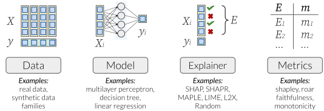

<p align="center"></p>

[]()


`Compare-xAI` is a library for benchmarking feature attribution / feature importance Explainable AI techniques using different tests. 

See our [NeurIPS paper][arxiv] (under review).

You can check directly the benchmark results at https://karim-53.github.io/cxAI/


# Table of Content

- [1. Download](#1-download)
- [2. Run experiments](#2-run-experiments)
  * [2.1 Install required packages](#21-install-required-packages)
  * [2.2 Reset experiment results](#22-reset-experiment-results)
  * [2.3 Computing ressouces](#23-computing-ressouces)
- [3. Contributing](#3-contributing)
  * [3.1 Add a new Explainer](#31-add-a-new-explainer)
  * [3.2 Add a new test](#32-add-a-new-test)
- [More details](#more-details)
  * [Reference](#reference)
  * [Cite Us](#cite-us)

<small><i><a href='http://ecotrust-canada.github.io/markdown-toc/'>Table of contents generated with markdown-toc</a></i></small>


[//]: # (<p align="center"></p>)

# 1. Download
All data are located in `data/`

The list of shortlisted tests is in `data/01_raw/test.csv`.

Info about explainers could be found in `data/03_experiment_output_aggregated/explainer.csv`

Raw score results are in `data/03_experiment_output_aggregated/cross_tab.csv`

The data is also available as one SQLite database file `data/04_sql/database`.

# 2. Reproduce experiments
Want to reproduce the results shown in [our paper][arxiv] ? Follow these instructions:
## 2.1 Install required packages

[//]: # (There is no specific requirements listed in `requirements.txt` you can run only a few tests and a few Explainer with a small set of packages. So just install what is needed on the go :&#41; )
[//]: # (`requirements.txt` contains a good start)
install the required packages using
```
pip install -r requirements.txt
```

## 2.2 Reset experiment results

Run the following command to explain the currently implemented tests using the currently implemented explainers.

```
python reset_experiment.py
```
The results are written in `data/02_experiment_output/results.csv`.
Now run the following command to aggregate results in a more human-readable format.
```
python src/aggregate_data.py
```
This also generate an SQLite database used in https://karim-53.github.io/cxAI/
`data/04_sql/database` aggregate all data: information about tests, explainers, papers, and results of all experiments.

**Tip**: Reduce the list explainers by changing `valid_explainers` in `src/explainer.py`. Same for the tests, see `src/test.py`.

## 2.3 Computing ressouces
Experiments were run over a normal computer (see [CPU-Z report](https://karim-53.github.io/cxai/CPU-Z.html)) without a GPU.

Total execution time: 4h 18min 18sec


# 3. Contributing
To add a new Explainer algorithm or a test to the benchmark, please follow the instructions below.

## 3.1 Add a new Explainer

.1 Create a python script `explainers/my_explainer.py`.

.2 Create `MyExplainer` class that inherit from `Explainer` superclass. Have a look at `explainers/saabas.py` to better understand how to implement the explainer. Also do not hesitate to import a library and to add it to `requirements.txt`. 

.3 In `src/explainer.py` add `MyExplainer` to the list of `valid_explainers`.

.4 Run `reset_experiment.py` then run `src/aggregate_data.py`.
src/aggregate_data.py

## 3.2 Add a new Test

.1 Create a python script `explainers/my_explainer.py`.

.2 Create `MyTest` class that inherit from `Test` superclass. Have a look at `tests/cough_and_fever.py` to better understand how to implement the test. Also do not hesitate to import a library and to add it to `requirements.txt`. 

.3 In `src/test.py` add `MyTest` to the list of `valid_tests`.

.4 Run `reset_experiment.py` then run `src/aggregate_data.py`.


---

# More details

## FAQ
### What is a functional test ?
Functional testing is a popular testing technique for software engineers. The following definition is adapted from the software engineering field to our intended usage in machine learning.  
Functional tests are created by testers with no specific knowledge of the algorithm's internal modules, i.e., not the developers themselves. Therefore, the algorithm is considered a black-box and is executed from end to end.  
Each functional test is intended to verify an end-user requirement on the xAI algorithm rather than a specific internal module. Thus, functional tests share the advantage of being able to test different algorithms, if they respect the same input and output format. On the other hand, failed tests do not inform about the location of the errors but rather attribute it to the entire algorithm.

### Which metrics are used to evaluate an xAI algorithm?
3 metrics are used:

**Comprehensibility**: a high Comprehensibility mean that it is easy for data scientist to interpret the explanation provided by an xAI algorithm without making errors. We compress all results from shortlisted tests into this metric as explained in the paper.

**Portability**: is the number of test the xAI can execute. xAI(s) that accept different AI models or data sctructure have a higher protability.

**Average execution time**: of the tests 

Let's consider 2 examples:

*maple*     : portability=17 (high, i.e. can explain different models), comprehensibility=49.15% (bad)

*tree_shap* : portability=11 (low, i.e. can explain only a few models), comprehensibility=74.15% (good)

It is the choice of the data scientist to use a general xAI with medium performance (like maple) or a specialized xAI algorithm with an explanation respecting a most of the known end-user requirements.


### How to reproduce experiment ?

The full original code is made available in this repo. Plus you can find a summary of the experiment setup in https://github.com/Karim-53/Compare-xAI/blob/main/data/03_experiment_output_aggregated/test.csv
 
## Reference
The source code was inspired from https://github.com/abacusai/xai-bench and https://github.com/mtsang/archipelago
## Cite Us

Please cite our work if you use code from this repo:

```bibtex
 
```
[arxiv]: http://arxiv.org
